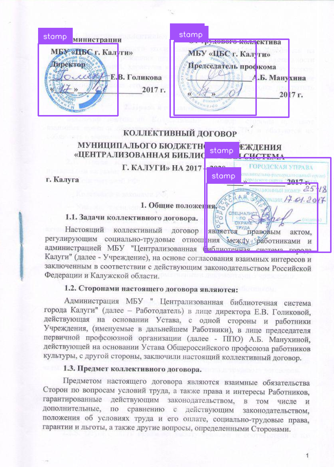
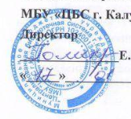
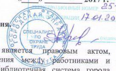

# Minecraftors StampExtractor

## AIQoD Hackathon '25 | Problem Statement 3

A comprehensive solution for extracting overlapping stamps and signatures from documents using YOLO object detection. This project is the result of collective efforts by Shivam, Arin, Varad, and Yasir for the AIQoD hackathon organized at VIT Chennai.

## 📋 Overview

Minecraftors StampExtractor is a document processing tool designed to:

- Upload PNG documents for analysis
- Process images using a pre-trained YOLO model
- Annotate detected objects with bounding boxes and labels
- Extract detected objects as separate images
- Provide a simple and intuitive web interface

## 🚀 Features

- **High Performance Detection**: Trained YOLOv12 model achieves mAP50 of 0.825 and mAP50-95 of 0.448
- **Complete Training Pipeline**: Includes data preparation, model training, evaluation, and inference
- **Streamlit Web Application**: User-friendly interface for uploading and analyzing documents

## 📊 Model Performance

- **mAP 50:95**: 0.448
- **mAP 50**: 0.825
- **mAP 75**: 0.418

## 🔄 Workflow


### Step 1: Document Upload Interface


### Step 2: Document Upload Interface


## Workflow Demonstration

### Step 1: Input Document


### Step 2: Stamp and Sign Recognition


### Step 3: ROI Extraction



### Step 4: Signature Segmentation


### Step 5: Stamp Separation


## 📁 Dataset

The dataset comprises document images containing stamps, created and managed through Roboflow:
- 1,422 training images
- 82 validation images
- Test set for model evaluation

## 📂 Project Structure

```
project_root/
├── Colab-NoteBooks/           # Jupyter notebooks for model training
│   └── stamp-detect-crop.ipynb # Main training notebook
├── webapp/                    # Streamlit application files
│   ├── main.py                # Main application entry point
│   ├── config.py              # Configuration settings
│   ├── requirements.txt       # Python dependencies
│   ├── modules/
│   │   ├── __init__.py            
│   │   ├── storage_manager.py # Manages file storage operations
│   │   ├── image_processor.py # Handles image processing with YOLO
│   │   └── ui_manager.py      # Manages Streamlit UI components
│   ├── storage/               # Directory for uploaded files
│   ├── output/                # Directory for processed images
│   ├── extracted/             # Directory for extracted objects
│   └── model/                 # Directory for YOLO model
│       └── best.pt            # YOLO model file
└── lightning_logs/           # Training logs and checkpoints
```

## 🛠️ Installation

### Prerequisites

- Python 3.8 or higher
- Git (optional)

### Step 1: Clone the Repository

```bash
git clone https://github.com/your-username/minecraftors-stampextractor.git
cd minecraftors-stampextractor
```

### Step 2: Set Up a Virtual Environment

#### Windows

```bash
python -m venv venv
venv\Scripts\activate
```

#### macOS/Linux

```bash
python3 -m venv venv
source venv/bin/activate
```

### Step 3: Install Dependencies

```bash
pip install -r requirements.txt
```

### Step 4: Prepare the YOLO Model

Place your trained YOLO model file (`best.pt`) in the `webapp/model/` directory. If needed, update the model path in `config.py`.

## 💻 Usage

### Training

```python
from ultralytics import YOLO

# Load the model
model = YOLO('yolov12s.yaml')

# Train the model
results = model.train(data='path/to/data.yaml', epochs=100)
```

### Inference

```python
import supervision as sv
from ultralytics import YOLO

# Load the trained model
model = YOLO('path/to/best.pt')

# Run inference on an image
results = model(image_path)[0]

# Process detections
detections = sv.Detections.from_ultralytics(results).with_nms()

# Visualize results
box_annotator = sv.BoxAnnotator()
annotated_image = box_annotator.annotate(scene=image.copy(), detections=detections)
```

### Web Application

Run the Streamlit app:

```bash
cd webapp
streamlit run main.py
```
<p align="center">
    <video width="600" controls>
        <source src="image_assests/Screen%20Recording%202025-03-06%20232351.mp4" type="video/mp4">
    </video>
</p>


The application will start and open in your default web browser at `http://localhost:8501`.

## 📱 Using the Application

1. **Upload a Document**:
   - Click the "Upload Document (PNG)" button
   - Select a PNG file from your computer

2. **Process the Document**:
   - After uploading, you'll see a preview of your document
   - Click the "Proceed with Inference" button to run object detection

3. **View Results**:
   - The processed image with annotations will be displayed
   - Individual extracted objects will be shown below

## ⚙️ Configuration

You can customize the application by modifying `config.py`:

- `STORAGE_PATH`: Directory for uploaded files
- `OUTPUT_PATH`: Directory for processed images
- `EXTRACTED_PATH`: Directory for extracted objects
- `MODEL_PATH`: Path to the YOLO model file
- `APP_TITLE`: Application title
- `APP_DESCRIPTION`: Application description

## 📦 Dependencies

- `streamlit`: Web application framework
- `ultralytics`: YOLO implementation
- `supervision`: Annotation utilities for object detection
- `opencv-python`: Image processing
- `numpy`: Numerical computations
- `Pillow`: Image handling
- `PyTorch`: Deep learning framework

## 🧩 Project Components

### 1. Storage Manager (`modules/storage_manager.py`)

Handles all file operations, including:
- Saving uploaded files
- Saving processed output images
- Saving extracted object images

### 2. Image Processor (`modules/image_processor.py`)

Manages image processing tasks:
- Loading the YOLO model
- Running object detection
- Annotating detected objects
- Extracting objects from images

### 3. UI Manager (`modules/ui_manager.py`)

Controls the Streamlit interface:
- Setting up the page layout
- Creating the file upload section
- Displaying the image processing section
- Showing results and extracted objects

## 🤝 Contributing

Contributions are welcome! Please feel free to submit a Pull Request.

## 👨‍💻 Authors

- **Shivam**
- **Arin**
- **Varad**
- **Yasir**

## 📜 License

This project is licensed under the MIT License - see the LICENSE file for details.
